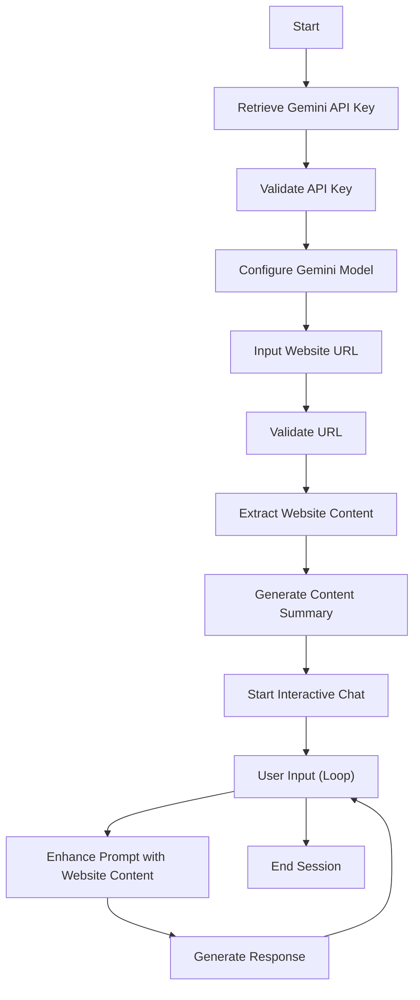

# Website Content Chatbot

## Objective
Develop an interactive chatbot that can extract content from a given website URL and enable users to ask questions about the website's content using Google's Gemini AI model through a console-based interface.

## Key Functions

### 1. `validate_url(url)`
- Validates the format of the input URL
- Checks for valid scheme and network location
- Returns boolean indicating URL validity

### 2. `extract_website_content(url, max_chars=5000)`
- Fetches website content using requests library
- Uses BeautifulSoup to parse and clean HTML
- Removes script, style, and navigation elements
- Truncates content to specified maximum character length
- Handles potential request exceptions

### 3. `generate_initial_context(model, content)`
- Creates a concise 3-sentence summary of website content
- Uses Gemini model to generate summary
- Provides initial context for chat session

### 4. `configure_gemini_model(api_key)`
- Configures Gemini API with provided key
- Sets generation parameters like temperature, top_p
- Initializes Gemini generative model

### 5. `start_interactive_chat(model, url)`
- Validates URL and extracts website content
- Generates initial content summary
- Initiates interactive chat session
- Allows continuous user questioning about website content

## Flowchart



## Requirements
- Python 3.8+
- Libraries: 
  - requests
  - beautifulsoup4
  - google-generativeai

## Setup
1. Install required libraries:
   ```
   pip install requests beautifulsoup4 google-generativeai
   or 
   pip install -r requirements.txt
   ```
2. Obtain a Gemini API key from Google AI Studio 
3. Run the script and follow console prompts

## Usage
1. Run the script
2. Enter a valid website URL
3. View website content summary
4. Ask questions about the website
5. Type 'exit' to end the session

## Limitations
- Maximum website content: 5000 characters/ can be changed according to the usage 
- Requires stable internet connection
- Dependent on website's accessibility and structures as some sites are secure and simple html parser can't be able to parse all the data.