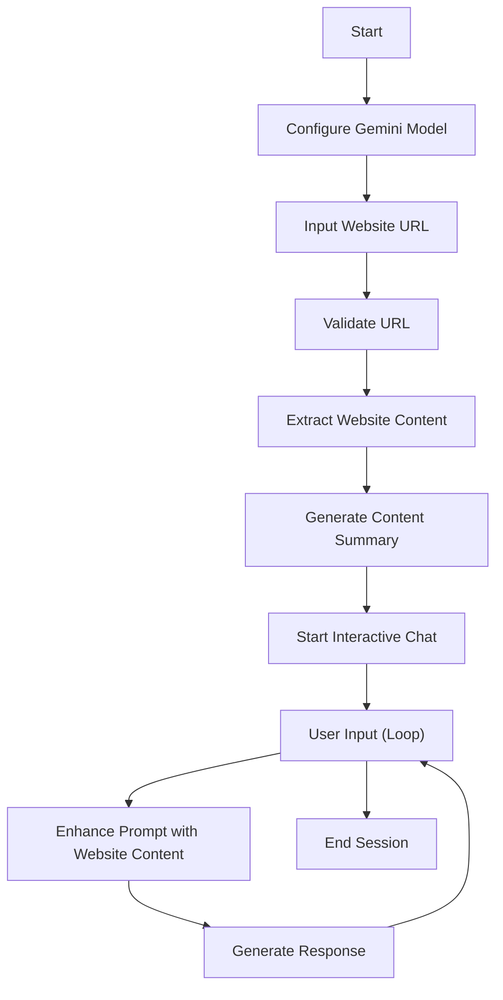

# Website Content Chatbot:[Youtube](https://youtu.be/a0E8HVjt7EM?si=euXpDxwtY-UwGZZM)

## Objective
Develop an interactive chatbot that can extract content from a given website URL and enable users to ask questions about the website's content using Google's Gemini AI model through a console-based interface.

This Python code creates a helpful chatbot that can answer your questions about any website you choose.
It takes a website URL, cleans up the content to focus on the main text, and then uses the Google Gemini Pro model to provide informative answers to your questions in an interactive chat.


## Key Functions

### 1. `validate_url(url)`
- Validates the format of the input URL
- Checks for valid scheme and network location
- Returns boolean indicating URL validity

### 2. `extract_website_content(url, max_chars=5000)`
- Fetches website content using requests library
- Uses BeautifulSoup to parse and clean HTML
- Removes script, style, and navigation elements
- Truncates content to specified maximum character length
- Handles potential request exceptions

### 3. `generate_initial_context(model, content)`
- Creates a concise 3-sentence summary of website content
- Uses Gemini model to generate summary
- Provides initial context for chat session

### 4. `configure_gemini_model(api_key)`
- Configures Gemini API with provided key
- Sets generation parameters like temperature, top_p
- Initializes Gemini generative model

### 5. `start_interactive_chat(model, url)`
- Validates URL and extracts website content
- Generates initial content summary
- Initiates interactive chat session
- Allows continuous user questioning about website content

## Flowchart




'''mermaid
graph TD
    subgraph Frontend
        UI[Web Interface]
        URL[URL Input]
        Chat[Chat Interface]
    end

    subgraph Backend
        Flask[Flask Server]
        Extract[Content Extractor]
        Gemini[Gemini AI Model]
        
        subgraph Endpoints
            Analyze[/analyze-website/]
            ChatMsg[/chat-message/]
        end
    end

    subgraph External
        Website[Target Website]
        GeminiAPI[Gemini API Service]
    end

    %% URL Analysis Flow
    URL --> |1. Submit URL| UI
    UI --> |2. POST Request| Analyze
    Analyze --> |3. Request Content| Extract
    Extract --> |4. Fetch| Website
    Website --> |5. Return HTML| Extract
    Extract --> |6. Extracted Text| Analyze
    Analyze --> |7. Generate Summary| Gemini
    Gemini --> |8. API Request| GeminiAPI
    GeminiAPI --> |9. Summary| Gemini
    Gemini --> |10. Return Summary| UI
    UI --> |11. Display| Chat

    %% Chat Flow
    Chat --> |1. Send Message| ChatMsg
    ChatMsg --> |2. Context + Question| Gemini
    Gemini --> |3. API Request| GeminiAPI
    GeminiAPI --> |4. Response| Gemini
    Gemini --> |5. Return Answer| Chat

    %% Styles
    classDef frontend fill:#d4e6ff,stroke:#333,stroke-width:2px
    classDef backend fill:#ffe7d4,stroke:#333,stroke-width:2px
    classDef external fill:#d4ffd4,stroke:#333,stroke-width:2px
    classDef endpoint fill:#ffd4d4,stroke:#333,stroke-width:2px

    class UI,URL,Chat frontend
    class Flask,Extract,Gemini backend
    class Website,GeminiAPI external
    class Analyze,ChatMsg endpoint
'''

## Requirements
- Python 3.8+
- Libraries: 
  - requests
  - beautifulsoup4
  - google-generativeai

## Setup
1. Install required libraries:
   ```
   pip install requests beautifulsoup4 google-generativeai
   or 
   pip install -r requirements.txt
   ```
2. Obtain a Gemini API key from Google AI Studio 
3. Run the script and follow console prompts

## Usage
1. Run the script
2. Enter a valid website URL
3. View website content summary
4. Ask questions about the website
5. Type 'exit' to end the session

## Limitations
- Maximum website content: 5000 characters/ can be changed according to the usage 
- Requires stable internet connection
- Dependent on website's accessibility and structures as some sites are secure and simple html parser can't be able to parse all the data.


## Resources used 
- [Gemini API Documentation](https://cloud.google.com/ai-platform/generativeai/docs/reference)
- [BeautifulSoup Documentation](https://www.crummy.com/software/BeautifulSoup/bs4/doc)
- [Understanding RAG: Building a RAG system from scratch with Gemini API](https://medium.com/@saurabhgssingh/understanding-rag-building-a-rag-system-from-scratch-with-gemini-api-b11ad9fc1bf7)
- [Explore document processing capabilities with the Gemini API ](https://ai.google.dev/gemini-api/docs/document-processing?lang=python)
- [Gemini API Python Client Library](https://github.com/google-research/google-research/tree)
