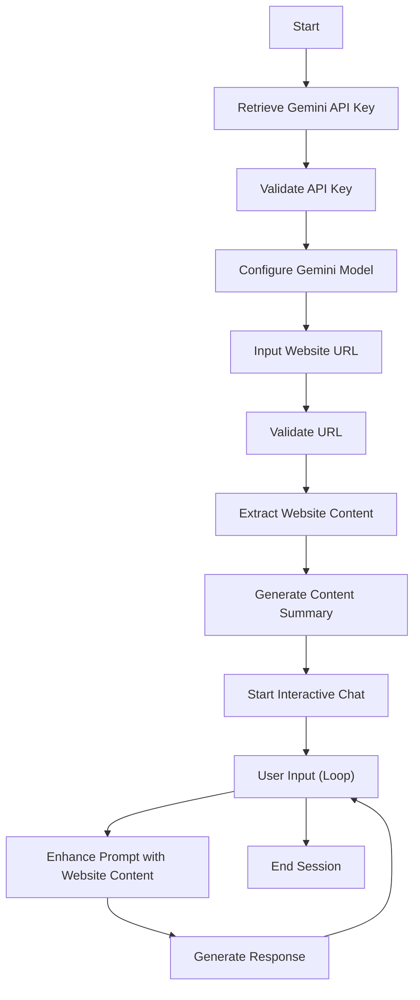

# Flowchart for Interactive Chat Code

This markdown file describes the flow of execution for the Python code.

## Description

The program allows users to input a website URL, extracts and processes the website's content, and initiates an interactive chat session based on that content using the Gemini model.

## Flowchart

## Key Steps

1. Retrieve the API key from an environment variable or prompt the user.
2. Validate the API key and abort if not provided.
3. Configure the Gemini model with the provided key and settings.
4. Prompt the user for a website URL and validate the format.
5. Fetch the website content, clean it, and truncate it to the maximum allowable length.
6. Generate a summary of the website content using the Gemini model.
7. Initiate an interactive chat session where users can ask questions based on the content.
8. Process user inputs, enhance prompts, and generate responses iteratively.
9. End the session when the user exits.

